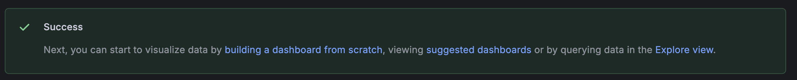

# Data source setup

If you're using a Grafana instance that we've provided for you, treat this section as reference material as we'll have installed the data source you need ahead of time.

If you're using your own Grafana Cloud or open source environment, read on...

## Goals

By the end of this section, you will have:

- Familiarized yourself with the Traitors UK data set
- Configured either the **Google Sheets** or **Infinity** data source in Grafana (make sure to check with your instructor before choosing)
- If using the Google Sheets data source, you will also have authenticated with an API key

**Need help?** Raise your hand and we'll come assist you!

## Google Sheets data source instructions

### Workshop spreadsheet

Open the sheet: **[UK Traitors Series 4 Tracker](https://docs.google.com/spreadsheets/d/1VcaZ4q8ZM2k6O9f6BGMRiWbXYbPQ3gbjLlFuAM4BcJU/edit?usp=sharing)**

Make a note of the **Spreadsheet ID**: `1VcaZ4q8ZM2k6O9f6BGMRiWbXYbPQ3gbjLlFuAM4BcJU`

The sheet includes columns such as `player`, `episode`, `voted_for`, `outcome`, `status`, `shield`, and `episode_date`. 

If you prefer to create your own Google Sheet, we've provided the raw CSV data [here](../data/raw_data.csv).  Import this into your Google Sheet, ensure that the sheet is shared publically and make a note of its ID.

### Step 1: Log in to your Grafana Instance

Open your Grafana Cloud stack in the browser (for example `https://<your-stack>.grafana.net`) and sign in.

### Step 2: TODO

TODO: This will be the Google Sheets data source installation.

### Step 3: Set up authentication

If you're using a Grafana environment provided specifically for this workshop, you may not need to perform this step.  Check with your instructor.

1. Open the Grafana menu and navigate to **Connections > Data sources**
2. Click or search `grafana-googlesheets-datasource`
TODO install the Google sheets data source?
3. Under **Authentication**, select **API Key**.
4. Expand the **Configure Google Sheets Authentication** drawer and follow the instructions to generate an API key.
5. Click the **Save and test** button

A successful connection shows the message "Success".

## Infinity data source instructions

TODO

TODO https://storage.googleapis.com/play-static-content/the-traitors-uk/raw_data.csv

---

[Workshop homepage](../README.md) · [Next exercise →](../2.%20first-panel-without-sql-expressions/)
