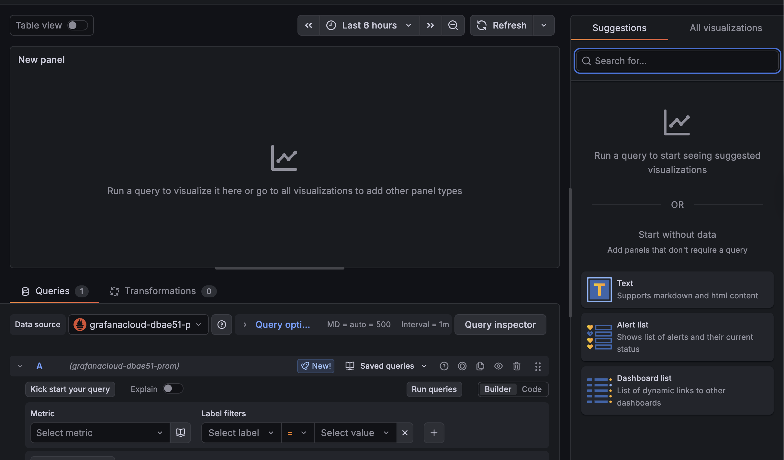
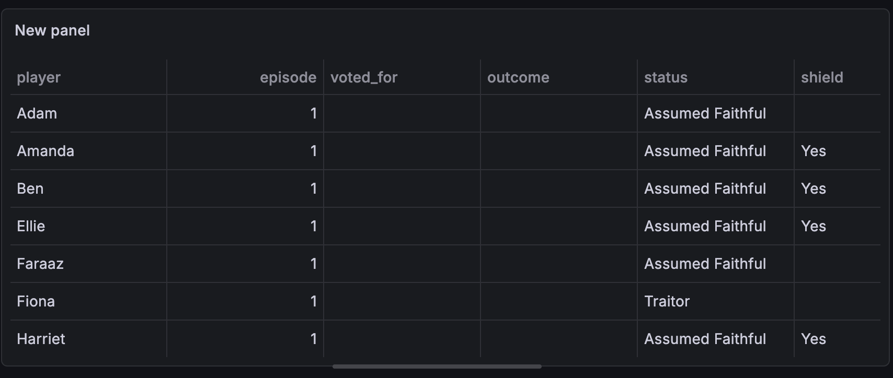

# First panel without SQL expressions

## Goals

By the end of this section, you will have:

- Created a **working Table panel** fed only by the Google Sheets data. There is **no SQL expressions yet** in this section to isolate any data source and query issues before you add transformations.

**Need help?** Raise your hand and we'll come assist you!

## Workshop spreadsheet

**[UK Traitors Series 4 Tracker](https://docs.google.com/spreadsheets/d/1VcaZ4q8ZM2k6O9f6BGMRiWbXYbPQ3gbjLlFuAM4BcJU/edit?usp=sharing)**

**Spreadsheet ID**: `1VcaZ4q8ZM2k6O9f6BGMRiWbXYbPQ3gbjLlFuAM4BcJU`

## Step 1: Create a new dashboard and panel

1. Open the Grafana menu and navigate to **Dashboards**.
2. Click **New > New dashboard**
3. Since we have configured the **Google Sheets** data source already, click **Skip to dashboard**.
4. On the right-hand side, drag or click to add a panel.
5. Click **Configure visualization**

You should see a new panel, like the one below.

### Step 2: Query the Traitors UK spreadsheet using the Google Sheets data source

In the query editor:

1. Update the data source by selecting `grafana-googlesheets-datasource` from the dropdown. 
2. Set **Spreadsheet** to the spreadsheet ID and hit enter.
3. Set **Range** if needed (for example `Sheet1!A:G` or leave default to pull the configured range—confirm against your sheet tab name).

Run the query and confirm you see the panel populated with data from the spreadsheet.

### Step 3: Save the dashboard

1. Save the dashboard and give it a name (for example **Traitors SQL expressions**).

## Next

You will reuse this dashboard and populate it with more panels, this time using basic SQL expressions.

---

[← Previous exercise](../1.%20google-sheets-data-source-setup/) · [Workshop homepage](../README.md) · [Next exercise →](../3.%20sql-expressions-basic-syntax/)
