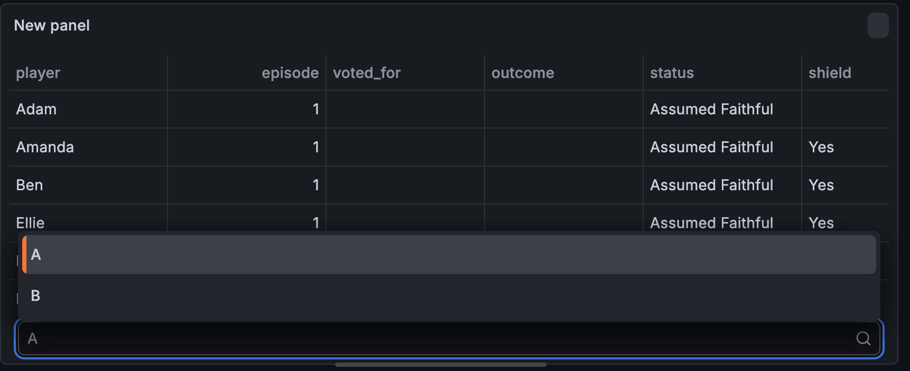
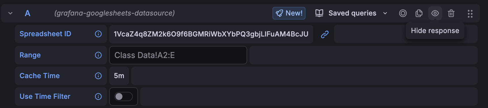

# SQL Expressions — basic syntax

## Goals

By the end of this section, you will have:

- Written basic **SQL Expressions** on top of the data source query

**Need help?** Use [code-snippets.md](./code-snippets.md) as a reference, or raise your hands and we'll come assist you!

## Step 1: Add the SQL Expression transformation

1. On the same table panel, under the **Queries** tab, click **+ Expression**.
2. Select **SQL**

## Step 2: Add the starter expression

In the **SQL expressions** section, start from picking a couple of columns you care about:

```sql
SELECT
  -- 1. Pick two or three columns you care about (e.g. player, status, shield)

  -- 2. Give at least one column a clearer alias with AS
FROM
  A
```

> [!NOTE]
> 
> The frame alias is usually **`A`** for the first query. If your panel uses multiple queries later, you will see **`B`**, **`C`**, and so on.
> 
> The “table name” **`A`** is also case sensitive in SQL expressions: **`a`** won't work but **`A`** will.

## Step 3: Run query

1. Click the **Run query** button
2. If you don't see any changes, don't panic! SQL Expressions add another query row on top of the existing query from our Google Sheets. To see the SQL expression results, select `B` from the panel table dropdown.



You should now only see the columns that you have picked from Step 2.

## Step 4: Hide response from query A

To only display the query result with SQL Expressions applied, you can hide the response of query A by clicking the **Hide response (eye icon)**, as seen in the image below.



TODO add Infinity example...

## Step 5: Rename your panel and save the dashboard

1. Give your panel a name (for example **Basic SQL Expression**)
2. Save the dashboard 

## Next

Let's look at writing more SQL expressions, and exploring other syntaxes like `WHERE`, `GROUP BY`, and `COUNT`.

---

[← Previous exercise](../2.%20first-panel-without-sql-expressions/) · [Workshop homepage](../README.md) · [Next exercise →](../4.%20sql-expressions-complex-syntax/)
