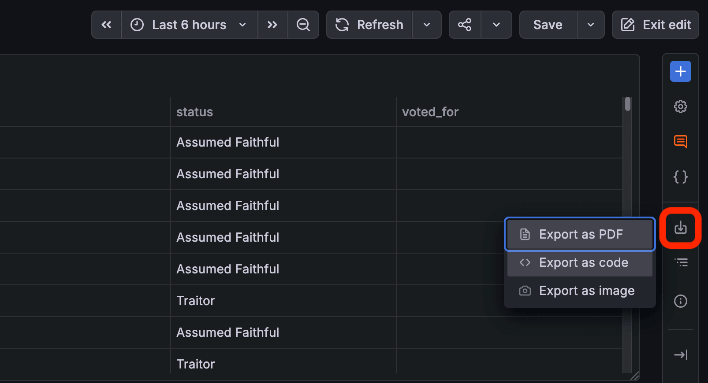
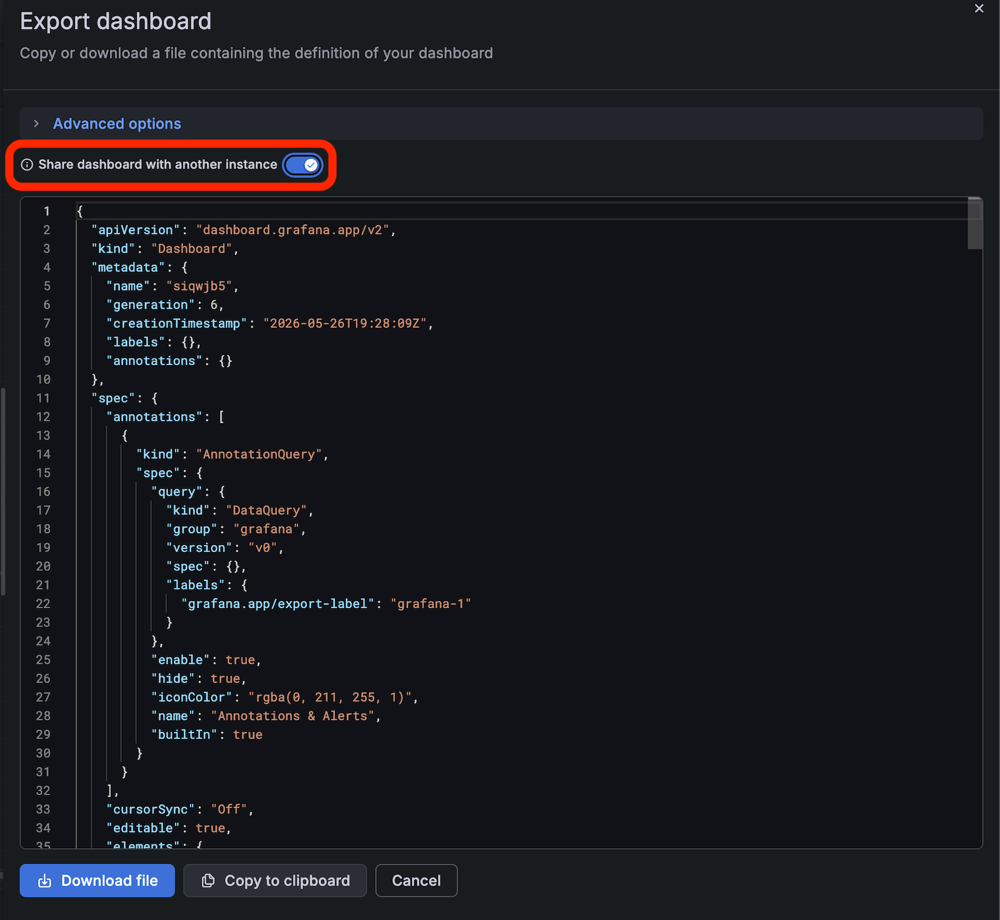

# Export your dashboard to take it with you!

If you're using your own Grafana Cloud or your self-hosted open source environment, treat this section as reference material as you'll always have access to your environment even once you've left the workshop.

If you're using a Grafana instance that we've provided for you, read on...

## Goals

By the end of this section, you will have:

- Downloaded the JSON file representing the current state and configuration of your dashboard.
- Learned how to import your dashboard into another Grafana instance.

**Need help?** Raise your hand and we'll come assist you!

### Step 1: Save your changes

1. Make sure your dashboard is in a state that you'd like to keep.
2. Click the **Save** button in the top right hand corner.

### Step 2: Export the dashboard JSON file

1. Locate the Export button to the right of the dashboard, click it then click **Export as code**:

2. Now, ensure that **Share dashboard with another instance** is toggled **ON**.

3. Click **Download** to download your dashboard as a JSON file.  Store this file somewhere safe.

### Step 3: Import the dashboard JSON file into another Grafana instance

When you're ready to use your dashboard in a new or different Grafana environment, follow these steps.

1. Ensure that the environment you're importing into has either the Google Sheets or Infinity data source.  You'll need to have the same type of data source that you used in the workshop.
2. If necessary, follow the [instructions in the data source setup step of this workshop](../1.%20data-source-setup/README.md) to configure the data source in your new environment.
3. Now follow the [dashboard import guide](https://grafana.com/docs/grafana/latest/visualizations/dashboards/build-dashboards/import-dashboards/) in the Grafana documentation to import your dashboard JSON.

---

[← Previous exercise](../6.%20advanced-exercises-bonus/) · [Workshop homepage](../README.md)